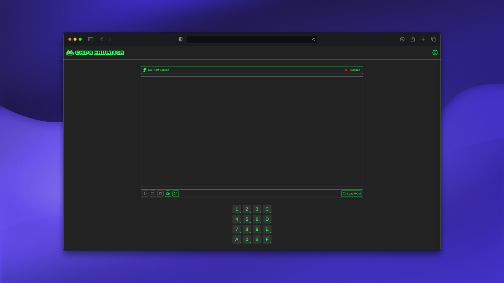

# Chip-8 Emulator

A modern CHIP-8, Super CHIP-8 (SCHIP), and XO-CHIP emulator written in TypeScript.

## 📸 Screenshot



## ✨ Features

- Complete support for CHIP-8, SCHIP, and XO-CHIP instruction sets
- Multiple font rendering options: Chip8, SCHIP, Octo, Fish'N'Chips, ETI-660, DREAM-6800
- Custom color palette support — create your own color schemes
- Customizable quirks for accurate emulation behavior
- Preset profiles for each supported chip type (CHIP-8, SCHIP, XO-CHIP)
- Adjustable cycles per second for performance tuning
- Configurable audio options
- ROM loading with drag-and-drop support
- Responsive web interface
- PWA (Progressive Web App) features

## 🚀 Demo

**[🌐 Try it live here!](https://chip8emulator.franciscodelahoz.com/)**

## 🎮 Usage

1. Visit the [live demo](https://chip8emulator.franciscodelahoz.com/)
2. Load a ROM by clicking "Load ROM" button
3. Adjust settings using the configuration panel
4. Enjoy playing!!

## 🛠️ Development & Build Instructions

### Prerequisites

- [Node.js](https://nodejs.org/) (v23 or higher)
- [pnpm](https://pnpm.io/) (recommended package manager)
- [fnm](https://github.com/Schniz/fnm) (optional, for easy Node.js version management)
### 1. Clone the repository

Clone the project to your local machine:

```bash
git clone https://github.com/franciscodelahoz/Chip8-Emulator.git
cd Chip8-Emulator
```

### 2. Set the correct Node.js version

If you use **fnm**:
```bash
fnm use
```

If you use **nvm**:
```bash
nvm use
```

Or manually select Node.js version **23 or higher**.

### 3. Install dependencies

Install all required packages with:
```bash
pnpm install
```

### 4. Start the development server

```bash
node --run dev
```
- Opens the app in hot-reload mode for rapid development.
- Visit [http://localhost:4000](http://localhost:4000) (or the port shown in your terminal).

### 5. Build for production

```bash
node --run build
```
- Generates the static files for deployment in the `dist` directory.

---

## 📝 License

This project is licensed under the MIT License. See the [LICENSE](LICENSE) file for details.

## 📚 Documentation & Resources

- **Cowgod's Chip-8 Technical Reference:**
  [Read the reference](http://devernay.free.fr/hacks/chip8/C8TECH10.HTM)
- **XO-CHIP Specification:**
  [Read the specification](https://johnearnest.github.io/Octo/docs/XO-ChipSpecification.html)
- **SuperChip Specification:**
  [Read the specification](https://johnearnest.github.io/Octo/docs/SuperChip.html)
